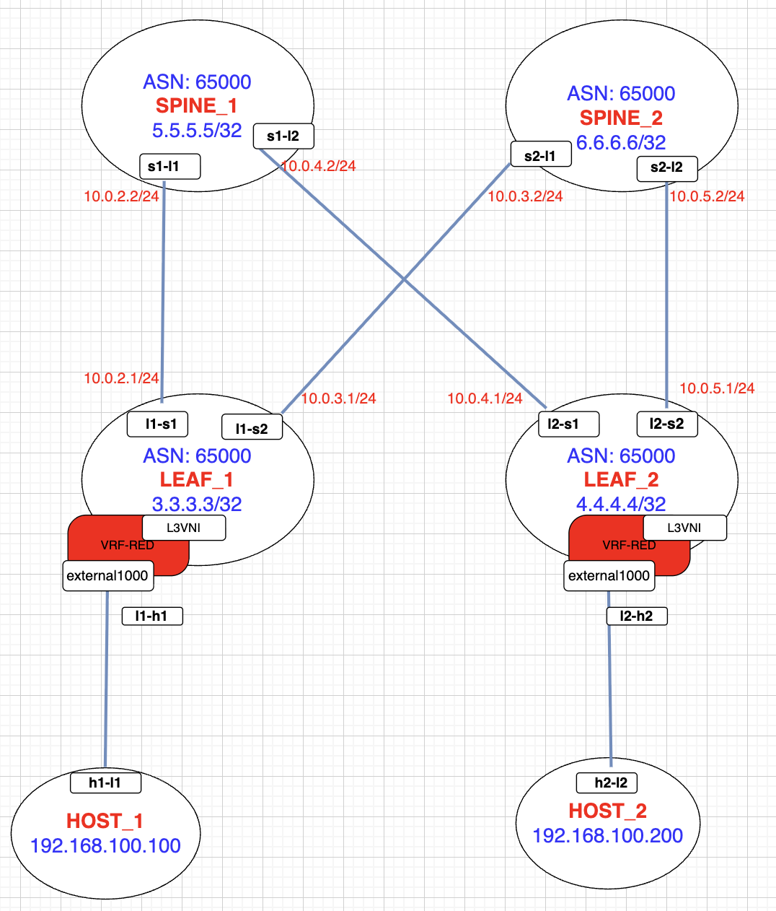

# Table of contents
- [Phase 0 – Environment Cleanup](#phase-0--environment-cleanup--preparation)
- [Phase 1 – Deploy Lab](#phase-1---deploy-lab)
- [Phase 2 – Underlay Configuration](#phase-2---underlay-configuration)
- [Phase 3 – Overlay Configuration](#phase-3---overlay-configuration)
- [Phase 4 – Connectivity Tests](#phase-4---connectivity-tests)
- [Phase 5 – Troubleshooting & Debugging](#phase-5---troubleshooting--debugging)

# Phase 0 – Environment Cleanup & Preparation
Before starting a new deployment, ensure all existing lab components are removed to prevent interface conflicts.

```bash
docker rm -f leaf_1 leaf_2 spine_1 spine_2 2>/dev/null

rm -f /var/run/netns/leaf_1 /var/run/netns/leaf_2 /var/run/netns/spine_1 /var/run/netns/spine_2 /var/run/netns/host_1 /var/run/netns/host_2 /var/run/netns/host_3 /var/run/netns/host_4 /var/run/netns/host_5

# Delete any leftover cables on the host 
ip link del l1-s1 2>/dev/null 
ip link del l1-s2 2>/dev/null 
ip link del l2-s1 2>/dev/null 
ip link del l2-s2 2>/dev/null
ip link del h1-l1 2>/dev/null 
ip link del h2-l2 2>/dev/null 

ip netns delete host_1
ip netns delete host_2
ip netns delete host_3
ip netns delete host_4
ip netns delete host_5

mkdir -p /var/run/netns
```

# Phase 1 - DEPLOY LAB
FRR documentation: [FRR eVPN concepts](https://docs.frrouting.org/en/latest/evpn.html#evpn-concepts)

Access: `ssh root@10.13.80.123`

## Lab topology


## DEPENDENCIES
Create directory: `mkdir /var/run/netns`

Install dependencies: 
```bash
apt-get update
apt-get install -y docker.io
modprobe vrf
```

# Phase 2 - UNDERLAY CONFIGURATION
**What we are building**

This lab builds an **iBGP-based IPv4 underlay** with explicitly addressed
leaf–spine point-to-point links.

There is **no IGP** in the fabric.
Instead, FRR is used with **iBGP and `next-hop-self force`**
to ensure loopback reachability between leaf VTEPs.

The underlay provides:
* **IP reachability** between leaf and spine loopbacks.
* **Transport** for the EVPN control plane.
* A stable **routing foundation** for VXLAN overlays.

**Device Roles in this Phase**
Spines (SPINE_1, SPINE_2)
* Run iBGP underlay only.
* Provide IP transport between Leaf nodes.
* Do not participate in EVPN or VXLAN overlay functions.

**Leafs (LEAF_1, LEAF_2)**
* Run iBGP toward spines using **IPv4-addressed point-to-point links**
* All devices operate in the same ASN (65000)
* No IGP is used

## Underlay IP Addressing

Leaf–spine links use IPv4 point-to-point addressing:

| Link              | Leaf IP        | Spine IP       |
|-------------------|----------------|----------------|
| LEAF_1 ↔ SPINE_1  | 10.0.2.1/24    | 10.0.2.2/24    |
| LEAF_1 ↔ SPINE_2  | 10.0.3.1/24    | 10.0.3.2/24    |
| LEAF_2 ↔ SPINE_1  | 10.0.4.1/24    | 10.0.4.2/24    |
| LEAF_2 ↔ SPINE_2  | 10.0.5.1/24    | 10.0.5.2/24    |

These addresses are used **only for BGP transport**.
All overlay traffic is carried via VXLAN.

## Loopbacks (VTEP IDs / BGP router-ids)

Loopbacks are defined in the FRR container configs (mounted into `/etc/frr/frr.conf`).
They are used as BGP router-ids and as the VXLAN VTEP source IPs.

- LEAF_1: 3.3.3.3/32
- LEAF_2: 4.4.4.4/32
- SPINE_1: 5.5.5.5/32
- SPINE_2: 6.6.6.6/32


## LEAF_1 CONFIGURATION
```bash
echo ">>> Setting up LEAF_1..."
docker run --name leaf_1 \
    --hostname leaf_1 \
    --net=none \
    --privileged \
    -d \
    --restart=always \
    -v /root/EVPN/leaf_1/leaf_1.conf:/etc/frr/frr.conf:shared \
    -v /root/EVPN/daemons:/etc/frr/daemons \
    -v /root/EVPN/vtysh.conf:/etc/frr/vtysh.conf \
    quay.io/frrouting/frr:10.1.3

sleep 2
L1_PID=$(docker inspect -f '{{.State.Pid}}' leaf_1)
ln -s /proc/${L1_PID}/ns/net /var/run/netns/leaf_1

# 1. Create the Cables (Leaf 1 to Spines)
ip link add l1-s1 type veth peer name s1-l1
ip link add l1-s2 type veth peer name s2-l1

# 2. Plug in the LEAF side only (Spines don't exist yet!)
ip link set l1-s1 netns leaf_1
ip link set l1-s2 netns leaf_1

# 3. Configure Leaf 1 Interfaces
ip netns exec leaf_1 ip link set lo up
ip netns exec leaf_1 ip link set l1-s1 up
ip netns exec leaf_1 ip link set l1-s2 up

# 4. Assign IPs
ip netns exec leaf_1 ip addr add 10.0.2.1/24 dev l1-s1
ip netns exec leaf_1 ip addr add 10.0.3.1/24 dev l1-s2
```

## LEAF_2 CONFIGURATION
``` bash
echo ">>> Setting up LEAF_2..."
docker run --name leaf_2 \
    --hostname leaf_2 \
    --net=none \
    --privileged \
    -d \
    --restart=always \
    -v /root/EVPN/leaf_2/leaf_2.conf:/etc/frr/frr.conf:shared \
    -v /root/EVPN/daemons:/etc/frr/daemons \
    -v /root/EVPN/vtysh.conf:/etc/frr/vtysh.conf \
    quay.io/frrouting/frr:10.1.3

sleep 2
L2_PID=$(docker inspect -f '{{.State.Pid}}' leaf_2)
ln -s /proc/${L2_PID}/ns/net /var/run/netns/leaf_2

# 1. Create the Cables (Leaf 2 to Spines)
ip link add l2-s1 type veth peer name s1-l2
ip link add l2-s2 type veth peer name s2-l2

# 2. Plug in the LEAF side only
ip link set l2-s1 netns leaf_2
ip link set l2-s2 netns leaf_2

# 3. Configure Leaf 2 Interfaces
ip netns exec leaf_2 ip link set lo up
ip netns exec leaf_2 ip link set l2-s1 up
ip netns exec leaf_2 ip link set l2-s2 up

# 4. Assign IPs
ip netns exec leaf_2 ip addr add 10.0.4.1/24 dev l2-s1
ip netns exec leaf_2 ip addr add 10.0.5.1/24 dev l2-s2
```

## SPINE_1 CONFIGURATION
``` bash
echo ">>> Setting up SPINE_1..."
docker run --name spine_1 \
    --hostname spine_1 \
    --net=none \
    --privileged \
    -d \
    --restart=always \
    -v /root/EVPN/spine_1/spine_1.conf:/etc/frr/frr.conf:shared \
    -v /root/EVPN/daemons:/etc/frr/daemons \
    -v /root/EVPN/vtysh.conf:/etc/frr/vtysh.conf \
    quay.io/frrouting/frr:10.1.3

sleep 2
S1_PID=$(docker inspect -f '{{.State.Pid}}' spine_1)
ln -s /proc/${S1_PID}/ns/net /var/run/netns/spine_1

# 1. Grab the "Dangling Cables" from the Host
# (s1-l1 was created by Leaf 1)
# (s1-l2 was created by Leaf 2)
ip link set s1-l1 netns spine_1
ip link set s1-l2 netns spine_1

# 2. Configure Spine 1 Interfaces
ip netns exec spine_1 ip link set lo up
ip netns exec spine_1 ip link set s1-l1 up
ip netns exec spine_1 ip link set s1-l2 up

# 3. Assign IPs
ip netns exec spine_1 ip addr add 10.0.2.2/24 dev s1-l1
ip netns exec spine_1 ip addr add 10.0.4.2/24 dev s1-l2
```

## SPINE_2 CONFIGURATION
``` bash
echo ">>> Setting up SPINE_2..."
docker run --name spine_2 \
    --hostname spine_2 \
    --net=none \
    --privileged \
    -d \
    --restart=always \
    -v /root/EVPN/spine_2/spine_2.conf:/etc/frr/frr.conf:shared \
    -v /root/EVPN/daemons:/etc/frr/daemons \
    -v /root/EVPN/vtysh.conf:/etc/frr/vtysh.conf \
    quay.io/frrouting/frr:10.1.3

sleep 2
S2_PID=$(docker inspect -f '{{.State.Pid}}' spine_2)
ln -s /proc/${S2_PID}/ns/net /var/run/netns/spine_2

# 1. Grab the "Dangling Cables" from the Host
# (s2-l1 was created by Leaf 1)
# (s2-l2 was created by Leaf 2)
ip link set s2-l1 netns spine_2
ip link set s2-l2 netns spine_2

# 2. Configure Spine 2 Interfaces
ip netns exec spine_2 ip link set lo up
ip netns exec spine_2 ip link set s2-l1 up
ip netns exec spine_2 ip link set s2-l2 up

# 3. Assign IPs
ip netns exec spine_2 ip addr add 10.0.3.2/24 dev s2-l1
ip netns exec spine_2 ip addr add 10.0.5.2/24 dev s2-l2
```

**IMPORTANT**:
 Confirm that all processes are moved to namespaces:
* `ip netns pids leaf_1`
* `ip netns pids leaf_2`
* `ip netns pids spine_1`
* `ip netns pids spine_2`

This part build EVPN using configuration from gitlab: [EVPN-iBGP-unnambered
](https://gitlab.datacrunch.io/networking/misc/-/tree/master/EVPN/EVPN-iBGP-unnum?ref_type=heads)
Please note that SPINE_1 and SPINE_2 run underlay ONLY!
Overlay is run on LEAF_1 and LEAF_2

## VERIFICATION
```bash
docker exec -it leaf_1 vtysh -c "show bgp summary"

docker exec -it spine_1 vtysh -c "show bgp summary"

# Link + IP sanity
ip netns exec leaf_1 ip -br a
ip netns exec leaf_2 ip -br a
ip netns exec spine_1 ip -br a
ip netns exec spine_2 ip -br a

# Underlay reachability tests (transport before BGP)
ip netns exec leaf_1 ping -c 2 10.0.2.2
ip netns exec leaf_1 ping -c 2 10.0.3.2
ip netns exec leaf_2 ping -c 2 10.0.4.2
ip netns exec leaf_2 ping -c 2 10.0.5.2
```

`ip netns exec leaf_1 ping -c 2 4.4.4.4`
* Loopback reachability (requires BGP up)*
(leaf1 ↔ leaf2 loopback reachability if your configs permit)

*If you don’t want to assume IPs on underlay links, at least say: “BGP must be Established on all leaf↔spine sessions before continuing.*

Proceed to Phase 3 only if:
* All leaf↔spine BGP neighbors are **Established**
* Namespaces exist for `leaf_1`/`leaf_2`/`spine_1`/`spine_2`
* All underlay veth links are `UP` inside namespaces

# Phase 3 - OVERLAY CONFIGURATION
**What we are building**
In this phase, we perform the "Kernel Plumbing" to support **Symmetric IRB** routing. This allows traffic to move between different subnets by using a dedicated L3 VNI for routing between VRFs across the fabric.
* L3 VNI Bridge: Acts as the "glue" that connects the VXLAN tunnel to the VRF.
* Symmetric IRB Requirement: Forwarding must be enabled on these bridge interfaces for routing to function.

## LEAF_1
### L3
```bash
# Create VRF: vrf-red and assign it to table 20000
ip netns exec leaf_1 ip link add vrf-red type vrf table 20000


# Create BRIDGE: EXTERNAL20000 (Glue Bridge for L3 Routing) 
# This bridge connects the VXLAN tunnel to the VRF.
ip netns exec leaf_1 ip link add external20000 type bridge

# Bring up VRF-RED and BRIDGE UP
ip netns exec leaf_1 ip link set external20000 up
ip netns exec leaf_1 ip link set vrf-red up

# Confirm BRIDGE and VRF-RED status
ip netns exec leaf_1  ip a

# Enslave the Bridge to the VRF (This allows the VRF to "see" the VXLAN tunnel)
ip netns exec leaf_1 ip link set external20000 master vrf-red

# Configure Kernel parameters: Enable ARP processing and Forwarding on the Bridge 
# (Required for EVPN Symmetric IRB routing)
BRIDGE=external20000
ip netns exec leaf_1 sysctl -w net.ipv4.conf.${BRIDGE}.arp_accept=1
ip netns exec leaf_1 sysctl -w net.ipv4.conf.${BRIDGE}.proxy_arp=1
ip netns exec leaf_1 sysctl -w net.ipv4.conf.${BRIDGE}.forwarding=1

# Create L3 VXLAN interface (VNI 20000)
ip netns exec leaf_1 ip link add vxlan20000 type vxlan local 3.3.3.3 dstport 4789 id 20000 nolearning

#Attach VXLAN interface to the bridge so bridged traffic can be VXLAN-encapsulated
# remote VTEPs come from EVPN control-plane.”
ip netns exec leaf_1 ip link set vxlan20000 master external20000

# Optimize VXLAN: Disable data-plane learning and suppress ARP floods
ip netns exec leaf_1 ip link set vxlan20000 type bridge_slave neigh_suppress on learning off

# Set MTU (Must be done before bringing interface UP for some drivers, or flush routes after)
ip netns exec leaf_1 ip link set vxlan20000 mtu 9100

# Bring VXLAN interface UP
ip netns exec leaf_1 ip link set vxlan20000 up

```

CHECK FRR:
```bash
docker exec -it leaf_1  vtysh
show evpn vni
```

### L2:
```bash
# Create BRIDGE: EXTERNAL10000 (Tenant VLAN Bridge)
ip netns exec leaf_1 ip link add external10000 type bridge

# Attach L2 Bridge to the VRF to enable Inter-VLAN Routing (IRB) 
# This allows Hosts in this Bridge to route to other subnets via the VRF.
ip netns exec leaf_1 ip link set external10000 master vrf-red

# Bring up BRIDGE and ensure VRF is UP
ip netns exec leaf_1 ip link set external10000 up
ip netns exec leaf_1 ip link set vrf-red up

# Configure the Default Gateway IP (SVI) on the Bridge interface 
# This is an Anycast IP (it is the same on all Leaf switches)
ip netns exec leaf_1 ip addr add 192.168.100.1/24 dev external10000 

# Add Anycast gateway MAC address (Must match Leaf 1 for Anycast to work)
ip netns exec leaf_1 ip link set external10000 addr de:ad:00:01:00:00

# Set Kernet networking params:
export BRIDGE=external10000
ip netns exec leaf_1 sysctl -w net.ipv4.conf.${BRIDGE}.arp_accept=1
ip netns exec leaf_1 sysctl -w net.ipv4.conf.${BRIDGE}.proxy_arp=1
ip netns exec leaf_1 sysctl -w net.ipv4.conf.${BRIDGE}.forwarding=1

# Creates VXLAN port (VNI 10000)
ip netns exec leaf_1 ip link add vxlan10000 type vxlan local 3.3.3.3 dstport 4789 id 10000 nolearning

# Bring vxlan10000 port up
ip netns exec leaf_1 ip link set vxlan10000 up

# Master the VXLAN port to the Bridge
ip netns exec leaf_1 ip link set vxlan10000 master external10000

# Optimize VXLAN: Disable data-plane learning (rely on BGP) and suppress ARP floods
ip netns exec leaf_1 ip link set vxlan10000 type bridge_slave neigh_suppress on learning off

# Set vxlan10000 MTU
ip netns exec leaf_1 ip link set vxlan10000 mtu 9100

```

### Check
```bash
# Check if all interfaces/ports/bridges or vrf are down
ip netns exec leaf_1 ip a  | grep -i down

# Post checks:
ip netns exec leaf_1 ip a | grep -i down - check all created status 
docker exec -it leaf_1  vtysh
show evpn vni
show int brief
```

## HOST_1
```bash
# Create NS for host_1
ip netns add host_1 

# Create veth between leaf_1 and host_2
ip link add h1-l1 type veth peer name l1-h1

# Assign cable endpoints
ip link set h1-l1 netns host_1
ip link set l1-h1 netns leaf_1

# Bring all interfaces up
ip netns exec host_1 ip link set lo up
ip netns exec host_1 ip link set h1-l1 up
ip netns exec leaf_1 ip link set l1-h1 up

# Assign IP address on host_1 interface
ip netns exec host_1 ip addr add 192.168.100.100/24 dev h1-l1

# Connect host to the external1000 switch
ip netns exec leaf_1 ip link set l1-h1 master external10000
```

### Checks
```bash
# Test ping host_1 to default gateway
ip netns exec host_1 ping 192.168.100.1
ip netns exec host_1 ping 192.168.100.100
```

## LEAF_2
### L3
```bash
# Create VRF: vrf-red (Tenant VRF) and assign table 20000
ip netns exec leaf_2 ip link add vrf-red type vrf table 20000

# Create BRIDGE: EXTERNAL20000 (L3 VNI Bridge)
ip netns exec leaf_2 ip link add external20000 type bridge

# Bring up VRF and Bridge
ip netns exec leaf_2 ip link set external20000 up
ip netns exec leaf_2 ip link set vrf-red up

# Verify interfaces
ip netns exec leaf_2 ip a

# Connect external20000 to VRF-RED
ip netns exec leaf_2 ip link set external20000 master vrf-red

# Set Kernel networking params for the Bridge
BRIDGE=external20000
ip netns exec leaf_2 sysctl -w net.ipv4.conf.${BRIDGE}.arp_accept=1
ip netns exec leaf_2 sysctl -w net.ipv4.conf.${BRIDGE}.proxy_arp=1
ip netns exec leaf_2 sysctl -w net.ipv4.conf.${BRIDGE}.forwarding=1

# Create L3 VXLAN interface (VNI 20000)
# Note: Local VTEP IP is 4.4.4.4 (Leaf 2 Loopback)
ip netns exec leaf_2 ip link add vxlan20000 type vxlan local 4.4.4.4 dstport 4789 id 20000 nolearning

# Attach VXLAN interface to the Bridge
ip netns exec leaf_2 ip link set vxlan20000 master external20000

# Optimize VXLAN: Disable data-plane learning and suppress ARP floods
ip netns exec leaf_2 ip link set vxlan20000 type bridge_slave neigh_suppress on learning off

# Set MTU (Must be done before bringing interface UP for some drivers, or flush routes after)
ip netns exec leaf_2 ip link set vxlan20000 mtu 9100

# Bring VXLAN interface UP
ip netns exec leaf_2 ip link set vxlan20000 up

```

### L2
```bash
# Create BRIDGE: EXTERNAL10000 (Tenant VLAN Bridge)
ip netns exec leaf_2 ip link add external10000 type bridge

# Attach L2 Bridge to existing L3 VRF (Enable Routing/IRB)
ip netns exec leaf_2 ip link set external10000 master vrf-red

# Bring up BRIDGE and ensure VRF is UP
ip netns exec leaf_2 ip link set external10000 up
ip netns exec leaf_2 ip link set vrf-red up

# Add default Anycast gateway IP (SVI)
ip netns exec leaf_2 ip addr add 192.168.100.1/24 dev external10000 

# Add Anycast gateway MAC address (Must match Leaf 1 for Anycast to work)
ip netns exec leaf_2 ip link set external10000 addr de:ad:00:01:00:00

# Set Kernel networking params:
export BRIDGE=external10000
ip netns exec leaf_2 sysctl -w net.ipv4.conf.${BRIDGE}.arp_accept=1
ip netns exec leaf_2 sysctl -w net.ipv4.conf.${BRIDGE}.proxy_arp=1
ip netns exec leaf_2 sysctl -w net.ipv4.conf.${BRIDGE}.forwarding=1

# Create VXLAN port (VNI 10000)
ip netns exec leaf_2 ip link add vxlan10000 type vxlan local 4.4.4.4 dstport 4789 id 10000 nolearning

# Bring vxlan10000 port up
ip netns exec leaf_2 ip link set vxlan10000 up

# Master the VXLAN port to the Bridge
ip netns exec leaf_2 ip link set vxlan10000 master external10000

# Optimize VXLAN: Disable data-plane learning (rely on BGP) and suppress ARP floods
ip netns exec leaf_2 ip link set vxlan10000 type bridge_slave neigh_suppress on learning off

# Set vxlan10000 MTU
ip netns exec leaf_2 ip link set vxlan10000 mtu 9100
```

## CHECKS
```bash
# CHECK FRR:
ip netns exec leaf_1 ip a | grep -i down - check all created status 
docker exec -it leaf_1  vtysh
show evpn vni
show int brief
```

## HOST_2
```bash
# Create Namespace for Host 2
ip netns add host_2 

# Create veth pair between Leaf 2 and Host 2
ip link add h2-l2 type veth peer name l2-h2

# Assign cable endpoints to namespaces
ip link set h2-l2 netns host_2
ip link set l2-h2 netns leaf_2

# Bring interfaces UP
ip netns exec host_2 ip link set lo up
ip netns exec host_2 ip link set h2-l2 up
ip netns exec leaf_2 ip link set l2-h2 up

# Assign IP address to Host 2
ip netns exec host_2 ip addr add 192.168.100.200/24 dev h2-l2

# Connect Host 2 to the Tenant Switch (external10000)
ip netns exec leaf_2 ip link set l2-h2 master external10000
```

# Phase 4 - CONNECTIVITY TESTS
```bash
# 1. Ping Default Gateway (Local Anycast Gateway on LEAF_2, VRF-RED)
# Host_2 IP: 192.168.100.200
ip netns exec host_2 ping -c 3 192.168.100.1

# 2. Ping HOST_1 from HOST_2
# Same subnet (192.168.100.0/24), EVPN L2 over VXLAN
# HOST_1 IP: 192.168.100.100
ip netns exec host_2 ping -c 3 192.168.100.100

# 3. Ping HOST_2 from HOST_1
# Same subnet (192.168.100.0/24), EVPN L2 over VXLAN
# HOST_2 IP: 192.168.100.200
ip netns exec host_1 ping -c 3 192.168.100.200

```

| Component      | Command                                      | Expected Result                                                                   |
|----------------|----------------------------------------------|-----------------------------------------------------------------------------------|
| BGP Status     | vtysh -c "show bgp summary"                  | Neighbors show **Established** state.                                             |
| EVPN VNIs      | vtysh -c "show evpn vni"                     | Lists L2 and L3 VNIs (for example: 10000, 20000).                                 |
| Kernel VRF     | ip netns exec leaf_1 ip vrf show              | Shows vrf-red mapped to tables 20000.                                            |
| Interfaces     | ip netns exec leaf_1 ip a \| grep -i down     | Returns no output if all interfaces are up and plumbing is correct.              |
| MAC Table      | bridge fdb show dev external10000             | Shows learned MAC addresses for connected hosts on the VXLAN bridge.             |

# Phase 5 - Troubleshooting & Debugging

If connectivity tests fail, use the following commands to isolate whether the issue lies in the **BGP control plane**, the **kernel data plane**, or **VXLAN encapsulation**.

---

## 5.1 FRR control-plane debugging

Access the FRR shell:

- docker exec -it <container_name> vtysh

Then run:

- Check BGP neighbors: show bgp summary  
  Expected: underlay neighbors are **Established** (confirm underlay before overlay).

- Check EVPN VNI status: show evpn vni  
  Expected: VNIs are present, active, and mapped to the correct VRFs.

- Verify VRF routing table: show ip route vrf <vrf-name>  
  Expected: routes from remote leafs appear in the local VRF routing table.

---

## 5.2 Real-time debugging logs (vtysh)

If routes are not appearing as expected, enable real-time logging in vtysh.  
Use these only when needed (they can be noisy).

| Focus area        | Command                     |
|------------------|-----------------------------|
| Kernel sync       | `debug zebra kernel`          |
| EVPN routing      | `debug bgp evpn mh route`     |
| BGP updates       | `debug bgp updates`           |
| Neighbor events   | `debug bgp neighbor-events`   |
| Zebra EVPN (MAC)  | `debug zebra evpn mh mac`     |

To enable debugging output in vtysh: `ter mon`

To disable debugging: `undebug all`

---

## 5.3 Kernel data-plane verification

Run commands inside the namespace:
*  `ip netns exec <ns_name> <command>`

Checks:

* Interface status: `ip a | grep -i down`  
  Expected: no bridges, VRFs, or VXLAN interfaces are administratively down.

* Forwarding check: `sysctl net.ipv4.conf.<interface>.forwarding`  
  Critical: Symmetric IRB will fail if forwarding is **0** on the bridge (must be **1**).

* Bridge plumbing: `bridge link show`  
  Expected: veth and vxlan interfaces are enslaved to the correct bridge.

* FDB / MAC table: `bridge fdb show`  
  Expected: kernel learns MAC addresses of remote hosts via VXLAN (after traffic flows).
